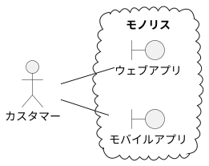

## モノリス

```plantuml:container_monolith
@startuml
skinparam monochrome true
skinparam handwritten false
skinparam defaultFontName "Yu Gothic UI, sans-serif"
left to right direction
actor カスタマー
cloud モノリス {
    boundary ウェブアプリ
    boundary モバイルアプリ
    カスタマー -- ウェブアプリ
    カスタマー -- モバイルアプリ
}
@enduml
```

