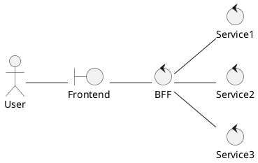
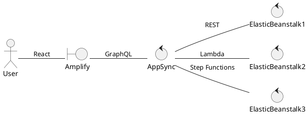
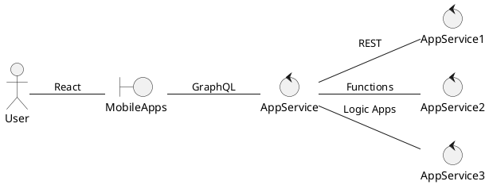
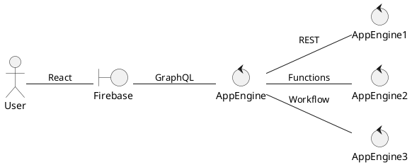

# コンテナ

```plantuml
@startuml
skinparam monochrome true
skinparam handwritten false
skinparam defaultFontName "Yu Gothic UI, sans-serif"
left to right direction
actor User
boundary Frontend
control BFF
control Service1
control Service2
control Service3
User -- Frontend
Frontend -- BFF
BFF -- Service1
BFF -- Service2
BFF -- Service3
@enduml
```

## AWS

```plantuml
@startuml
skinparam monochrome true
skinparam handwritten false
skinparam defaultFontName "Yu Gothic UI, sans-serif"
left to right direction
actor User
boundary Amplify
control AppSync
control ElasticBeanstalk1
control ElasticBeanstalk2
control ElasticBeanstalk3
User -- Amplify : React
Amplify -- AppSync : GraphQL
AppSync -- ElasticBeanstalk1 : REST
AppSync -- ElasticBeanstalk2 : Lambda
AppSync -- ElasticBeanstalk3 : Step Functions
@enduml
```

## Azure

```plantuml
@startuml
skinparam monochrome true
skinparam handwritten false
skinparam defaultFontName "Yu Gothic UI, sans-serif"
left to right direction
actor User
boundary MobileApps
control AppService
control AppService1
control AppService2
control AppService3
User -- MobileApps : React
MobileApps -- AppService : GraphQL
AppService -- AppService1 : REST
AppService -- AppService2 : Functions
AppService -- AppService3 : Logic Apps
@enduml
```

## GCP

```plantuml
@startuml
skinparam monochrome true
skinparam handwritten false
skinparam defaultFontName "Yu Gothic UI, sans-serif"
left to right direction
actor User
boundary Firebase
control AppEngine
control AppEngine1
control AppEngine2
control AppEngine3
User -- Firebase : React
Firebase -- AppEngine : GraphQL
AppEngine -- AppEngine1 : REST
AppEngine -- AppEngine2 : Functions
AppEngine -- AppEngine3 : Workflow
@enduml
```
