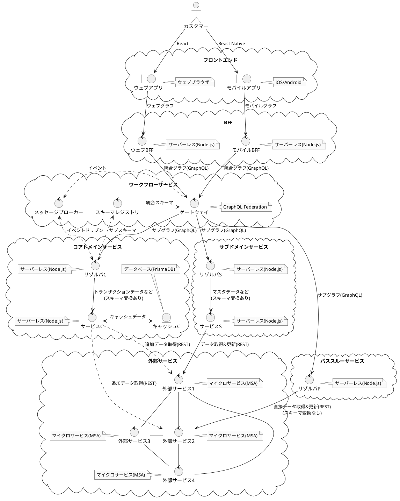
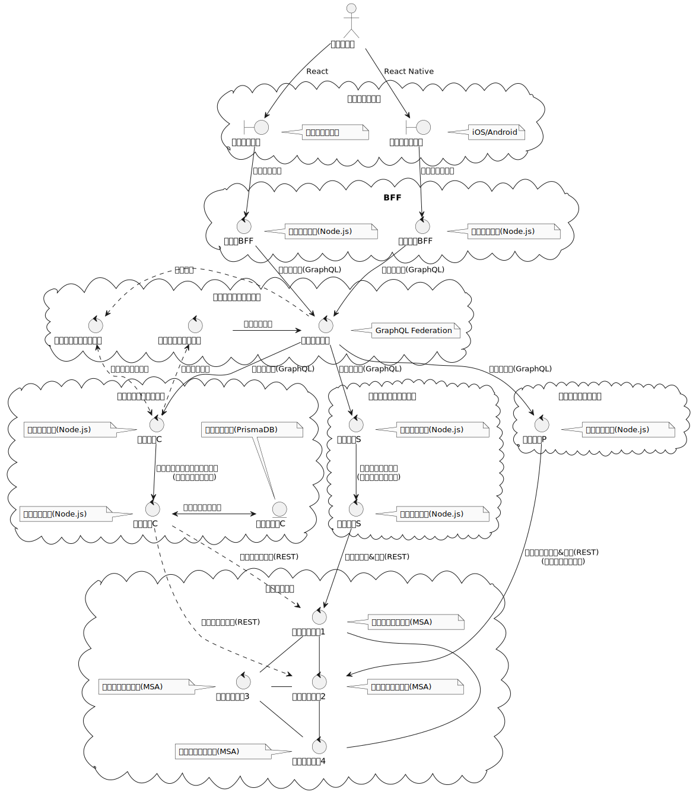

# コンテナ

## API ゲートウェイ

```plantuml:images_Container-Gateway
@startuml
skinparam monochrome true
skinparam handwritten false
skinparam defaultFontName "Yu Gothic UI, sans-serif"
'left to right direction
actor カスタマー
cloud フロントエンド {
    boundary ウェブアプリ
    note right: ウェブブラウザ
    boundary モバイルアプリ
    note right: iOS/Android
    カスタマー --> ウェブアプリ : React
    カスタマー --> モバイルアプリ : React Native
}
cloud BFF {
    control ウェブBFF
    note right: サーバーレス(Node.js)
    control モバイルBFF
    note right: サーバーレス(Node.js)
    ウェブアプリ --> ウェブBFF : ウェブグラフ
    モバイルアプリ --> モバイルBFF : モバイルグラフ
}
cloud ワークフローサービス {
    control ゲートウェイ
    note right: GraphQL Federation
    control スキーマレジストリ
    control メッセージブローカー
    ウェブBFF --> ゲートウェイ : 統合グラフ(GraphQL)
    モバイルBFF --> ゲートウェイ : 統合グラフ(GraphQL)
    ゲートウェイ <- スキーマレジストリ : 統合スキーマ
    メッセージブローカー <. ゲートウェイ : イベント
}
cloud コアドメインサービス {
    control リゾルバC
    note left: サーバーレス(Node.js)
    control サービスC
    note left: サーバーレス(Node.js)
    entity キャッシュC
    note top: データベース(PrismaDB)
    ゲートウェイ --> リゾルバC : サブグラフ(GraphQL)
    メッセージブローカー <..> リゾルバC : イベントドリブン
    リゾルバC --> サービスC : トランザクションデータなど\n(スキーマ変換あり)
    サービスC <-> キャッシュC : キャッシュデータ
    リゾルバC ..> スキーマレジストリ : サブスキーマ
}
cloud サブドメインサービス {
    control リゾルバS
    note right: サーバーレス(Node.js)
    control サービスS
    note right: サーバーレス(Node.js)
    ゲートウェイ --> リゾルバS : サブグラフ(GraphQL)
    リゾルバS --> サービスS : マスタデータなど\n(スキーマ変換あり)
}
cloud パススルーサービス {
    control リゾルバP
    note right: サーバーレス(Node.js)
    ゲートウェイ --> リゾルバP : サブグラフ(GraphQL)
}
cloud 外部サービス {
    control 外部サービス1
    note right: マイクロサービス(MSA)
    control 外部サービス2
    note right: マイクロサービス(MSA)
    control 外部サービス3
    note left: マイクロサービス(MSA)
    control 外部サービス4
    note left: マイクロサービス(MSA)
    外部サービス1 - 外部サービス2
    外部サービス1 -- 外部サービス3
    外部サービス1 - 外部サービス4
    外部サービス2 -- 外部サービス4
    外部サービス3 - 外部サービス4
    外部サービス3 - 外部サービス2
}
サービスC ..> 外部サービス1 : 追加データ取得(REST)
サービスC ..> 外部サービス2 : 追加データ取得(REST)
サービスS --> 外部サービス1 : データ取得&更新(REST)
リゾルバP --> 外部サービス2 : 直接データ取得&更新(REST)\n(スキーマ変換なし)
@enduml
```

