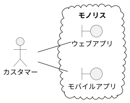
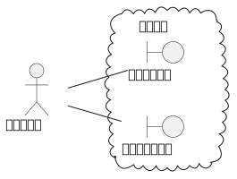
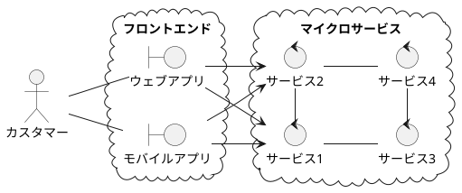
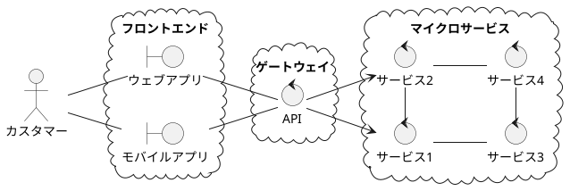
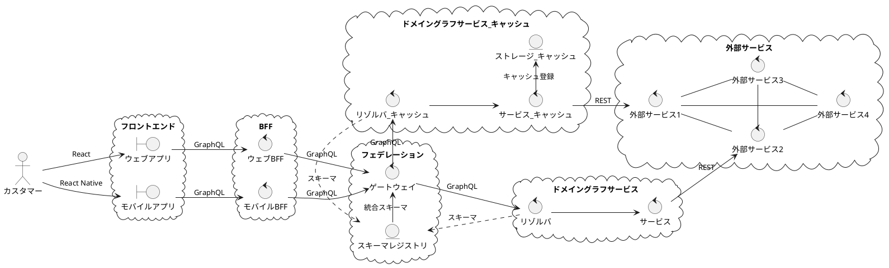

# コンテナ

## モノリス

```plantuml:container_monolith
@startuml
skinparam monochrome true
skinparam handwritten false
skinparam defaultFontName "Yu Gothic UI, sans-serif"
left to right direction
actor カスタマー
cloud モノリス {
    boundary ウェブアプリ
    boundary モバイルアプリ
    カスタマー -- ウェブアプリ
    カスタマー -- モバイルアプリ
}
@enduml
```

## マイクロサービスとダイレクトアクセス

```plantuml
@startuml
skinparam monochrome true
skinparam handwritten false
skinparam defaultFontName "Yu Gothic UI, sans-serif"
left to right direction
actor カスタマー
cloud フロントエンド {
    boundary ウェブアプリ
    boundary モバイルアプリ
    カスタマー -- ウェブアプリ
    カスタマー -- モバイルアプリ
}
cloud マイクロサービス {
    control サービス1
    control サービス2
    control サービス3
    control サービス4
    サービス1 - サービス2
    サービス1 -- サービス3
    サービス2 -- サービス4
    サービス3 - サービス4
    ウェブアプリ --> サービス1
    ウェブアプリ --> サービス2
    モバイルアプリ --> サービス1
    モバイルアプリ --> サービス2
}
@enduml
```

## マイクロサービスとゲートウェイ

```plantuml
@startuml
skinparam monochrome true
skinparam handwritten false
skinparam defaultFontName "Yu Gothic UI, sans-serif"
left to right direction
actor カスタマー
cloud フロントエンド {
    boundary ウェブアプリ
    boundary モバイルアプリ
    カスタマー -- ウェブアプリ
    カスタマー -- モバイルアプリ
}
cloud ゲートウェイ {
    control API
    ウェブアプリ -- API
    モバイルアプリ -- API
}
cloud マイクロサービス {
    control サービス1
    control サービス2
    control サービス3
    control サービス4
    サービス1 - サービス2
    サービス1 -- サービス3
    サービス2 -- サービス4
    サービス3 - サービス4
    API --> サービス1
    API --> サービス2
}
@enduml
```

## マイクロサービスと GraphQL フェデレーション

```plantuml
@startuml
skinparam monochrome true
skinparam handwritten false
skinparam defaultFontName "Yu Gothic UI, sans-serif"
left to right direction
actor カスタマー
cloud フロントエンド {
    boundary ウェブアプリ
    boundary モバイルアプリ
    カスタマー --> ウェブアプリ : React
    カスタマー --> モバイルアプリ : React Native
}
cloud BFF {
    control ウェブBFF
    control モバイルBFF
    ウェブアプリ --> ウェブBFF : GraphQL
    モバイルアプリ --> モバイルBFF : GraphQL
}
cloud フェデレーション {
    control ゲートウェイ
    entity スキーマレジストリ
    ウェブBFF --> ゲートウェイ : GraphQL
    モバイルBFF --> ゲートウェイ : GraphQL
    ゲートウェイ <- スキーマレジストリ : 統合スキーマ
}
cloud ドメイングラフサービス_キャッシュ {
    control リゾルバ_キャッシュ
    control サービス_キャッシュ
    entity ストレージ_キャッシュ
    ゲートウェイ --> リゾルバ_キャッシュ : GraphQL
    リゾルバ_キャッシュ --> サービス_キャッシュ
    サービス_キャッシュ -> ストレージ_キャッシュ : キャッシュ登録
    リゾルバ_キャッシュ ..> スキーマレジストリ : スキーマ
}
cloud ドメイングラフサービス {
    control リゾルバ
    control サービス
    ゲートウェイ --> リゾルバ : GraphQL
    リゾルバ --> サービス
    リゾルバ ..> スキーマレジストリ : スキーマ
}
cloud 外部サービス {
    control 外部サービス1
    control 外部サービス2
    control 外部サービス3
    control 外部サービス4
    外部サービス1 - 外部サービス2
    外部サービス1 -- 外部サービス3
    外部サービス1 - 外部サービス4
    外部サービス2 -- 外部サービス4
    外部サービス3 - 外部サービス4
    外部サービス3 - 外部サービス2
}
サービス_キャッシュ --> 外部サービス1 : REST
サービス --> 外部サービス2 : REST
@enduml
```
